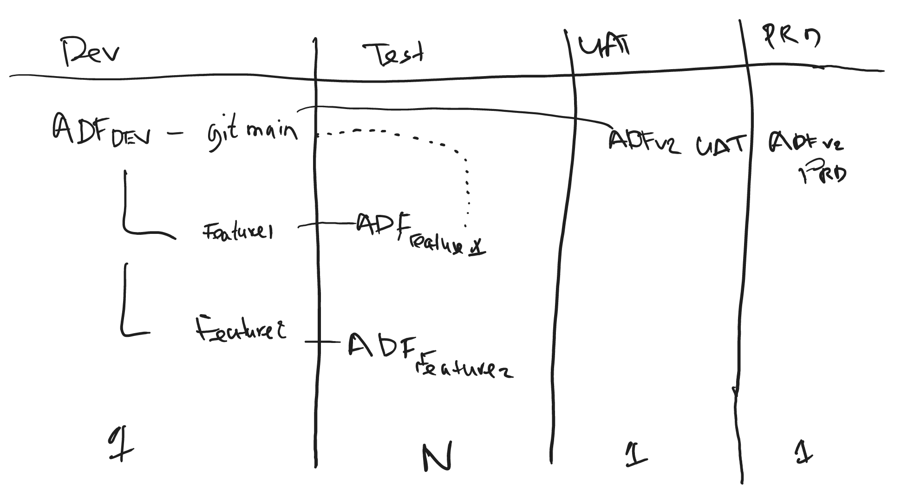

# Azure Data Factory CICD project to create feature releases

This repo shows how Azure Data Factory utility library can be leveraged to create feature releases. NPM library can be found in ```package.json```.

Detailed explanation of solution to be created, CICD flow can already be found below.

